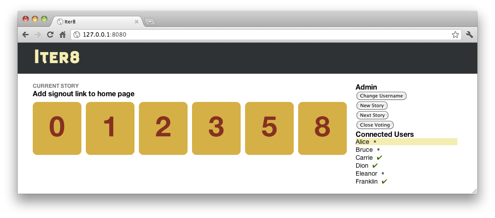

# Iter8 #

Iter8 is a tool for pointing stories as part of an agile development cycle. Users connect and vote on how long it will take to complete stories. When all users have voted, a results screen shows the vote distribution, plus average and median point values.

## Use ##

Start the Iter8 server by running `node app.js`. Users should be able to connect the server at port 8080.